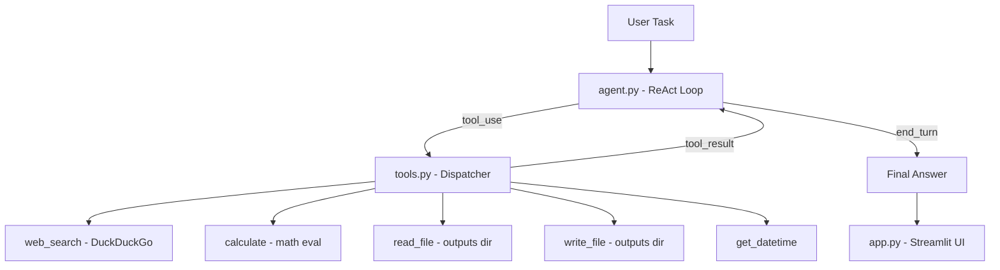

# Research Assistant AI Agent

> Give it a task. It searches the web, runs calculations, reads and writes files —
> then delivers a structured report. All autonomously.

🌐 **[Live Demo](https://your-app.streamlit.app)** &nbsp;|&nbsp; ⭐ Star this repo if it helped you!


---

## What It Does

You type a task in plain English. The agent breaks it down, calls the right tools in
the right order, and hands you a finished result — no hand-holding required.

**Example tasks you can try:**

```
Search for the latest AI industry trends in 2025, calculate the market growth rate,
and save a summary report to a file.
```

```
Compare Python vs JavaScript job market demand in 2025 and write a career advice report.
```

```
Find recent news about Claude and GPT-4, summarize the key differences, and save to file.
```

---

## How It Works — ReAct Loop

The agent runs a **Reasoning + Acting** loop: Claude thinks about what to do,
calls a tool, observes the result, thinks again, and repeats until the task is done.

```
User Task
    │
    ▼
Claude reasons → picks a tool → calls it
    │                               │
    │◄──────── tool result ─────────┘
    │
    ▼
Claude reasons again → pick next tool OR finish
    │
    ▼
Final answer (with tool outputs woven in)
```

This is fundamentally different from a simple function call —
the agent decides *which* tools to use, *in what order*, with *no predefined script*.

---

## Architecture



**Tech Stack:**

| Layer | Technology |
|---|---|
| LLM + Tool Use | Claude Haiku (`claude-haiku-4-5-20251001`) |
| Web Search | DuckDuckGo Search API (free, no key needed) |
| Frontend | Streamlit — real-time tool call visualization |
| API | Anthropic Python SDK |

---

## The 5 Tools

| Tool | Description | API Key Required |
|---|---|---|
| `web_search` | Search the web via DuckDuckGo | No |
| `calculate` | Safe math evaluation (supports `math.*`) | No |
| `read_file` | Read files from `outputs/` directory | No |
| `write_file` | Save reports to `outputs/` directory | No |
| `get_datetime` | Get current timestamp for report headers | No |

All tools are free. The only external API used is the Anthropic Claude API.

---

## Project Structure

```
research-agent/
├── agent.py            # Core ReAct loop — the brain of the agent
├── tools.py            # Tool implementations + dispatcher
├── tool_schemas.py     # Claude Tool Use schema definitions
├── app.py              # Streamlit UI with live tool call visualization
├── requirements.txt    # Python dependencies
├── .gitignore          # Excludes .env, outputs/, __pycache__
├── .streamlit/
│   └── secrets.toml    # Local API key config (not committed)
├── outputs/            # Agent-generated reports saved here
└── README.md
```

---

## Quick Start

```bash
# 1. Clone the repository
git clone https://github.com/your-username/research-agent.git
cd research-agent

# 2. Create and activate virtual environment
conda create -n agent_env python=3.11 -y
conda activate agent_env

# 3. Install dependencies
pip install -r requirements.txt

# 4. Configure your API key
echo 'ANTHROPIC_API_KEY=sk-ant-your-key-here' > .env

# 5a. Run the Streamlit UI
streamlit run app.py

# 5b. Or test the agent directly in the terminal
python agent.py
```

Open [http://localhost:8501](http://localhost:8501) in your browser.

---

## Deploying to Streamlit Cloud

1. Push this repo to GitHub (confirm `.env` is listed in `.gitignore`)
2. Go to [share.streamlit.io](https://share.streamlit.io) and sign in with GitHub
3. Click **New app** → select your repo → set main file to `app.py`
4. Click **Advanced settings → Secrets** and paste:

```toml
ANTHROPIC_API_KEY = "sk-ant-your-key-here"
```

5. Click **Deploy** — live in about 3 minutes

---

## Sample Output

After asking *"Search for AI market size in 2024 and calculate 30% annual growth for 3 years"*,
the agent autonomously:

1. Calls `get_datetime` → adds timestamp to report header
2. Calls `web_search("AI market size 2024")` → retrieves data
3. Calls `web_search("AI industry growth rate forecast")` → gets growth figures
4. Calls `calculate("330 * 1.3 ** 3")` → computes 3-year projection
5. Calls `write_file("ai_market_report.md", ...)` → saves the report
6. Returns a structured summary with all sources cited

The full report is saved to `outputs/ai_market_report.md`.

---

## Key Design Decisions

**Why Claude Tool Use instead of LangChain Agents?**
Claude's native Tool Use gives direct control over the agent loop with no
abstraction layer — easier to debug, reason about, and explain in interviews.

**Why DuckDuckGo instead of Google or Bing Search API?**
Zero setup, no API key, no billing — lets anyone clone and run this immediately.

**Why a 10-iteration cap?**
Prevents runaway loops on ambiguous tasks. Most tasks complete in 3 to 6 iterations;
the cap is a safety net, not a real constraint.

**Why separate `tool_schemas.py`?**
Keeping Claude's tool descriptions separate from the implementation makes it easy
to update descriptions (which affect Claude's behavior) without touching business logic.
